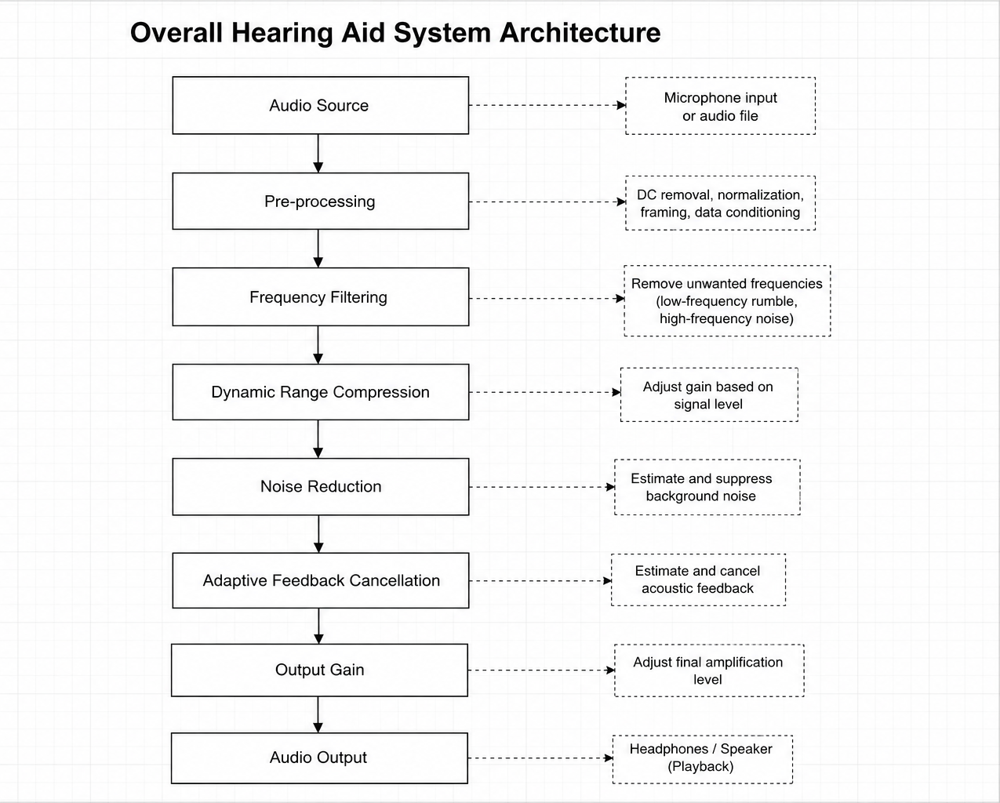

# System Architecture

> **Project:** Simulink Hearing Aid  
> **MathWorks Excellence in Innovation Challenge – Project #241**  
> **Author:** Mohammed Sharif  
> **Version:** 1.0

---

## Purpose

This document defines the overall architecture of the hearing-aid simulation developed using MATLAB and Simulink.

Rather than describing implementation details, this document specifies how the complete system is organised, how information flows through the system, and the responsibility of every subsystem.

The architecture presented here will serve as the blueprint for the complete development process.

---

## Design Philosophy

The hearing aid shall be developed as a modular Digital Signal Processing (DSP) system.

Each signal-processing stage shall be implemented as an independent subsystem so that:

- every module can be tested individually,
- modules can be replaced without affecting the remaining system,
- debugging becomes easier,
- future improvements can be integrated with minimal redesign.

The complete system follows a sequential real-time audio processing pipeline.

Each subsystem receives processed audio from the previous subsystem, performs one well-defined operation, and forwards the output to the next stage.

This modular approach closely resembles the architecture adopted in modern commercial digital hearing aids.

---

# Overall System Pipeline

The proposed hearing aid operates as a sequential Digital Signal Processing (DSP) pipeline.

Incoming sound is captured through a microphone and passes through a series of dedicated processing stages before being delivered to the listener.

Each stage performs one specialised task while preserving compatibility with the remaining system.

The complete processing pipeline is shown below.

```
Microphone
      │
      ▼
Audio Input
      │
      ▼
Pre-processing
      │
      ▼
Frequency Filtering
      │
      ▼
Dynamic Range Compression
      │
      ▼
Noise Reduction
      │
      ▼
Feedback Cancellation
      │
      ▼
Output Gain
      │
      ▼
Speaker / Headphones
```

Each processing stage modifies the signal according to its specific objective while preserving real-time operation.

The processing order has been selected to minimise distortion while improving speech intelligibility and listening comfort.

---

# Subsystem Responsibilities

The hearing-aid simulation is divided into independent processing subsystems. Each subsystem performs one clearly defined task and passes its output to the next stage in the processing pipeline.

---

## 1. Audio Input

### Purpose

Acquire real-time audio from the microphone or a prerecorded audio source.

### Inputs

- Acoustic signal (microphone)
- Audio file (testing mode)

### Outputs

- Digital audio samples

### Responsibility

- Capture incoming audio
- Convert to MATLAB/Simulink audio stream
- Supply data continuously to the processing pipeline

---

## 2. Pre-processing

### Purpose

Prepare the incoming audio for reliable DSP processing.

### Inputs

- Raw digital audio samples

### Outputs

- Conditioned audio signal

### Responsibility

- Remove DC offset
- Normalise signal amplitude
- Frame the audio into processing windows
- Prepare data format for downstream algorithms

---

## 3. Frequency Filtering

### Purpose

Remove unwanted frequency components while preserving speech.

### Inputs

- Pre-processed audio

### Outputs

- Filtered audio

### Responsibility

- Suppress low-frequency rumble
- Suppress high-frequency noise
- Preserve frequencies important for speech perception

---

## 4. Dynamic Range Compression

### Purpose

Reduce the dynamic range of incoming speech.

### Inputs

- Filtered audio

### Outputs

- Compressed audio

### Responsibility

- Amplify weak signals
- Reduce amplification of loud signals
- Improve speech audibility
- Prevent discomfort caused by excessive loudness

---

## 5. Noise Reduction

### Purpose

Improve listening comfort by suppressing background noise.

### Inputs

- Compressed audio

### Outputs

- Noise-reduced audio

### Responsibility

- Estimate background noise
- Reduce stationary noise components
- Preserve speech intelligibility

---

## 6. Feedback Cancellation

### Purpose

Prevent acoustic feedback between the speaker and microphone.

### Inputs

- Noise-reduced audio
- Estimated feedback signal

### Outputs

- Stable audio signal

### Responsibility

- Estimate acoustic feedback path
- Cancel feedback using adaptive filtering
- Maintain system stability

---

## 7. Output Gain

### Purpose

Apply the final amplification before playback.

### Inputs

- Processed audio

### Outputs

- Final hearing-aid output

### Responsibility

- Apply user-configurable output gain
- Prevent clipping
- Deliver processed audio to headphones or speakers

---

# Signal Flow Description

The hearing-aid simulation processes audio as a continuous stream of digital samples.

Rather than processing an entire recording at once, the system operates in real time by repeatedly processing small blocks of audio known as **frames**.

Each frame passes sequentially through every subsystem before the next frame enters the pipeline.

The processing sequence is illustrated below.

```
Audio Frame n
     │
     ▼
Audio Input
     │
     ▼
Pre-processing
     │
     ▼
Frequency Filtering
     │
     ▼
Dynamic Range Compression
     │
     ▼
Noise Reduction
     │
     ▼
Feedback Cancellation
     │
     ▼
Output Gain
     │
     ▼
Audio Output
     │
     ▼
Next Audio Frame
```

No subsystem skips another stage.

No subsystem processes future frames.

Each frame is processed independently while maintaining continuous real-time operation.

---

# Data Flow

Each subsystem receives only the information required to perform its assigned operation.

The output of one subsystem becomes the direct input of the next subsystem.

The signal remains entirely digital throughout the processing chain after acquisition.

The processing flow is therefore represented as

```
Digital Audio
     ↓
Filtered Audio
     ↓
Compressed Audio
     ↓
Noise Reduced Audio
     ↓
Feedback Cancelled Audio
     ↓
Output Audio
```

No intermediate subsystem directly communicates with non-adjacent subsystems.

This linear architecture improves modularity, debugging, testing, and future system expansion.

---

# Processing Strategy

The proposed hearing aid follows a **frame-based processing strategy**.

Instead of processing every individual sample independently, incoming audio is divided into fixed-duration frames.

Each frame undergoes the complete DSP pipeline before the next frame is processed.

Frame-based processing provides several advantages:

- Reduced computational overhead
- Improved real-time performance
- Compatibility with adaptive DSP algorithms
- Simplified buffering and scheduling
- Easier integration with Simulink Audio Toolbox blocks

This strategy is widely employed in modern real-time audio systems due to its balance between computational efficiency and signal quality.

---

# Functional Requirements

The hearing-aid simulation shall satisfy the following functional requirements.

## FR-01: Audio Acquisition

**Requirement**

The system shall accept audio from either:

- A real-time microphone input.
- A prerecorded audio file for offline testing.

---

## FR-02: Continuous Processing

**Requirement**

The system shall process incoming audio continuously using frame-based processing without requiring manual intervention after execution begins.

---

## FR-03: Signal Conditioning

**Requirement**

The system shall preprocess incoming audio before any DSP operation by preparing the signal for reliable processing.

---

## FR-04: Frequency Filtering

**Requirement**

The system shall remove unwanted frequency components while preserving the speech frequency range.

---

## FR-05: Dynamic Range Compression

**Requirement**

The system shall automatically adjust signal amplification according to input amplitude to improve speech audibility while maintaining listening comfort.

---

## FR-06: Noise Reduction

**Requirement**

The system shall reduce stationary background noise while preserving speech intelligibility.

---

## FR-07: Feedback Cancellation

**Requirement**

The system shall minimise acoustic feedback generated between the output speaker and input microphone.

---

## FR-08: Output Amplification

**Requirement**

The system shall provide configurable output gain before playback.

---

## FR-09: Real-Time Playback

**Requirement**

The processed audio shall be delivered immediately to the output device with minimal perceptible delay.

---

## FR-10: Modular Design

**Requirement**

Each processing stage shall operate as an independent subsystem that can be modified, replaced, or tested individually without affecting unrelated subsystems.

---

# Non-Functional Requirements

In addition to the functional requirements, the hearing-aid simulation shall satisfy the following engineering constraints.

## NFR-01: Low Latency

**Requirement**

The processing latency shall remain sufficiently low to support natural real-time conversation.

---

## NFR-02: Modularity

**Requirement**

The architecture shall remain modular to simplify maintenance, testing, and future expansion.

---

## NFR-03: Readability

**Requirement**

The Simulink model shall be organised using clearly named and documented subsystems.

---

## NFR-04: Scalability

**Requirement**

The architecture shall support future integration of advanced DSP modules such as:

- Beamforming
- Environment classification
- AI-based speech enhancement
- Adaptive parameter tuning

without requiring major redesign.

---

## NFR-05: Reproducibility

**Requirement**

The project shall execute successfully by following the instructions provided in the repository README, with minimal manual configuration.

---

## NFR-06: Maintainability

**Requirement**

All algorithms, models, and documentation shall be written clearly so that future contributors can understand, modify, and extend the system.

---

# System Architecture Diagram

The hearing-aid simulation follows a sequential modular Digital Signal Processing architecture.

Each subsystem performs a single well-defined task and passes the processed signal to the following subsystem.

The complete architecture is illustrated below.

> **Figure 1 – Overall Hearing Aid System Architecture**



The architecture consists of seven primary processing stages:

1. Audio Input
2. Pre-processing
3. Frequency Filtering
4. Dynamic Range Compression
5. Noise Reduction
6. Adaptive Feedback Cancellation
7. Output Gain

This architecture maintains a strictly linear signal path to improve modularity, maintainability, debugging, and future system expansion.